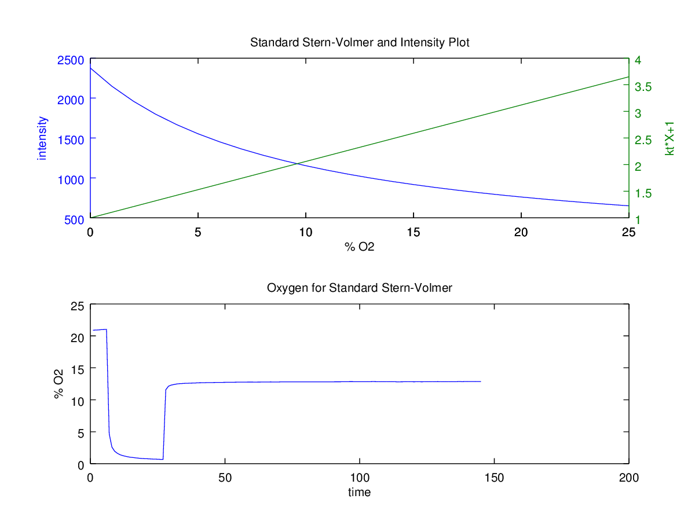
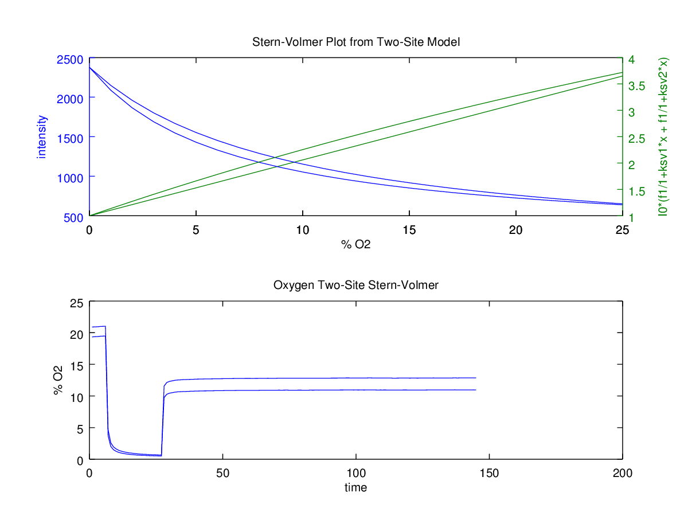

Stern-Volmer Analysis
=====================

Fluorescence intensity measurements of an oxygen sensor are used to calculate oxygen concentration.

<!---
latex2png.com
I_0/I=1+Ksv\cdot[Q]}
-->

I0 is the intensity of the sensor in absence of oxygen, Ksv is the Stern-Volmer constant, and Q is oxygen.

Ksv can be solved for using an I0 and a second calibration point.

<!---
latex2png.com
Ksv = \frac{I_0-I_c}{Q_0\cdot{I_0} - Q_c\cdot{I_c}}
-->
I0 and Q0 are the intensity and level of oxygen at one calibration point and Ic and Qc is the second calibration point.

A few handy plots to make are the Intensity Vs oxygen level and the Stern-Volmer plot.

	y = x*Ksv+1 % I0/I Vs oxygen
	y = I0/(1+Ksv*x) % Intensity Vs oxygen

Where x is a range of values from 1 to 100 for example

Two-Site Model
-----
This model assumes two quenching environments. It is used to fit curved Stern-Vomer plots.

<!---
latex2png.com
I/I_0=\frac{f_1}{1+Ksv_1\cdot[Q]}+\frac{f_2}{1+Ksv_2\cdot[Q]}
-->

f1 and f2 are fractions that sum to 1. Each quenching environment has a respective Ksv.
Calibration data at several points can be fitted to the model to yeild f1, f2, Ksv1, and Ksv2.

The plots for the two-site model are plotted along with the standard model.

